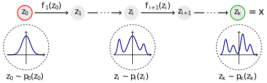
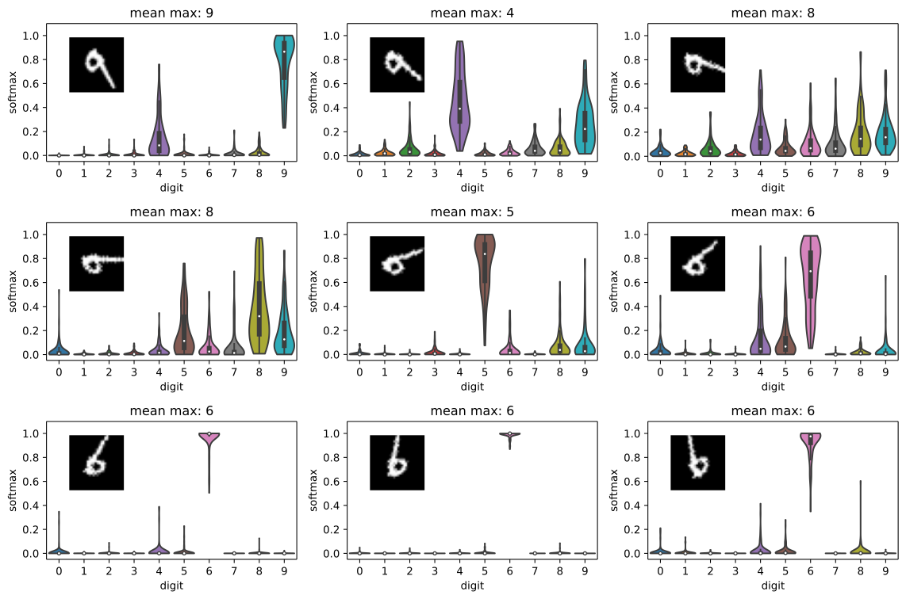
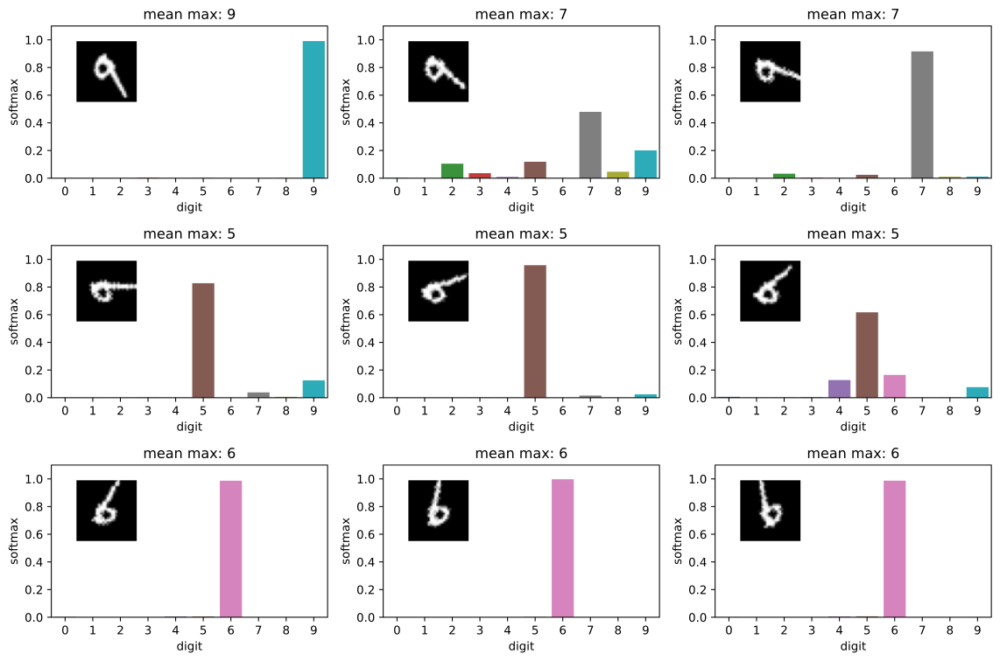

# TF-MNF

[](https://results.pre-commit.ci/latest/github/janosh/tf-mnf/master)
[](/license)




TensorFlow 2.0 implementation of Multiplicative Normalizing Flows (MNF). MNF is a Bayesian neural network variant introduced in [[1]](#tf-mnf) with auxiliary random variables and a factorial Gaussian posterior with means `mu_i` conditioned on scaling factors `z_i` modelled by normalizing flows.

Implements the planar [[3]](#vi-nf), RNVP [[4]](#rnvp) and MAF [[5]](#maf) flow. MAF uses the MADE autoregressive network architecture introduced in [[2]](#made)

## References

1. <a id="mnf-vbnn"></a> **_Multiplicative Normalizing Flows for Variational Bayesian Neural Networks_** | Christos Louizos, Max Welling (Mar 2017) | [1703.01961](https://arxiv.org/abs/1703.01961)

2. <a id="made"></a> **_MADE: Masked Autoencoder for Distribution Estimation_** | Mathieu Germain, Karol Gregor, Iain Murray, Hugo Larochelle (Jun 2015) | [1502.03509](https://arxiv.org/abs/1502.03509)

3. <a id="vi-nf"></a> **_Variational Inference with Normalizing Flows_** | Danilo Rezende, Shakir Mohamed (May 2015) | [1505.05770](https://arxiv.org/abs/1505.05770)

4. <a id="rnvp"></a> **_Density estimation using Real NVP_** | Laurent Dinh, Jascha Sohl-Dickstein, Samy Bengio (May 2016) | [1605.08803](https://arxiv.org/abs/1605.08803)

5. <a id="maf"></a> **_Masked Autoregressive Flow for Density Estimation_** | George Papamakarios, Theo Pavlakou, Iain Murray (Jun 2018) | [1705.07057](https://arxiv.org/abs/1705.07057)

6. <a id="bay-hyp"></a> **_Bayesian Hypernetworks_** | David Krueger, Chin-Wei Huang, Riashat Islam, Ryan Turner, Alexandre Lacoste, Aaron Courville (Oct 2017) | [1710.04759](https://arxiv.org/abs/1710.04759)

## MNF-LeNet vs regular LeNet5 on rotating MNIST

|                       MNF-LeNet                        |                     Regular LeNet                      |
| :----------------------------------------------------: | :----------------------------------------------------: |
|  |  |

A good test for Bayesian vision models is to take an MNIST 9 **and** rotate it in steps of 20 degree until we're back to a 6. This evaluates how the model and its uncertainty estimates perform as we slowly exit and then re-enter the training manifold.

The plots show how MNF applied to a [LeNet model](http://yann.lecun.com/exdb/lenet) compares to an unmodified LeNet. The code for these plots is found in [`notebooks/lenet_mnist.py`](/tf_mnf/notebooks/lenet_mnist.py).

In the top left, both models start out almost certain they're being shown a 9. A rotation of 20 degree already causes the MNF-LeNet to allocate small probabilities to other digits. The middle row is the most interesting since we're farthest away from the training manifold. MNF-LeNet distributes its softmax more evenly whereas the regular LeNet tends to focus its prediction on a single digit.

While the regular LeNet only outputs point estimates, the Bayesian MNF-LeNet returns distributions. An interesting thing to note is that the violins in the top and middle rows exhibit some non-Gaussian structure. In particular, some seem to be multimodal, suggesting that there might be multiple clusters of dissimilar network parametrizations that have slightly different opinions on how likely that digit is.

## Conda Environment

The environment file `env.yml` was generated with `conda env export --no-builds > env.yml`. To recreate the environment from this file run `conda env create -f env.yml`.

The environment `tf-mnf` was originally created by running the command:

```sh
conda create -n tf-mnf python=3.6 \
  && conda activate tf-mnf \
  && pip install tensorflow tensorflow-probability jupyter tqdm seaborn
```

To delete the environment run `conda env remove -n tf-mnf`.

To update all packages and reflect changes in this file use

```sh
conda update --all \
  && pip list --outdated --format=freeze | grep -v '^\-e' | cut -d = -f 1  | xargs -n1 pip install -U \
  && conda env export --no-builds > env.yml
```
